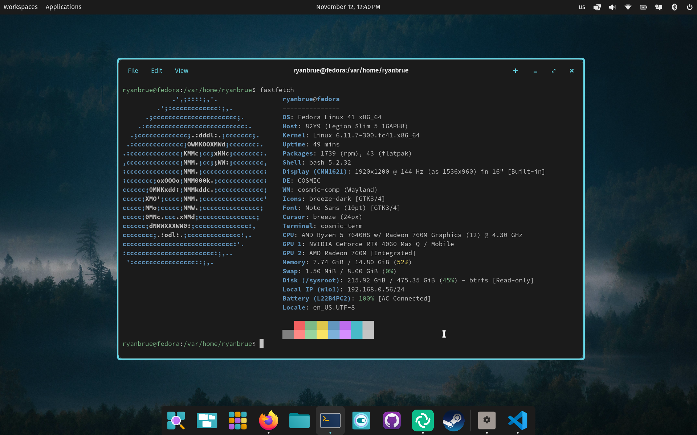

# Fedora Cosmic Atomic
### Fedora Silverblue-based Atomic Desktop with the Pre-Alpha Cosmic Desktop Environment included!

> NOTES:
> These images are not associated with System76! If you have issues, please understand they might be COSMIC related, OR they might be related to this image.
> The COSMIC Desktop Environment is still ALPHA. Do not daily drive this image on your main workstation unless you know what you're doing.

Like Fedora? Want to try the latest from the work in progress Cosmic Desktop Environment? Want to help find bugs and/or contribute to Cosmic development, but don't want to work in a VM or install Pop!_OS? None of the above things but something else??!?

Go ahead and try one of the ostree images I've created here!

### Quick Installation

Install a Fedora Atomic Desktop, like [Fedora Silverblue](https://fedoraproject.org/atomic-desktops/silverblue/).


#### Variants
- `cosmic`: Just the COSMIC Desktop
- `cosmic-silverblue`: Recommended, Fedora Silverblue with COSMIC Desktop added
- `cosmic-kinoite`: Fedora Kinoite with COSMIC Desktop addded

> NOTE: Rebase to the signed image, the unsigned image is only needed during the transition

Rebase to the temporary unsigned image

    rpm-ostree rebase --reboot ostree-unverified-registry:ghcr.io/outbackdingo/cosmic-nvidia:40-amd64

Rebase to the signed image

    rpm-ostree rebase --reboot ostree-image-signed:docker://ghcr.io/outbackdingo/cosmic-nvidia:40-amd64


### Secure Boot

Secure Boot is supported by default on our systems, providing an additional layer of security. After the first installation, you will be prompted to enroll the secure boot key in the BIOS.

Enter the password `universalblue` 
when prompted to enroll our key.

If this step is not completed during the initial setup, you can manually enroll the key by running the following command in the terminal:

`
ujust enroll-secure-boot-key
`

Secure boot is supported with our custom key. The pub key can be found in the root of the akmods repository [here](https://github.com/ublue-os/akmods/raw/main/certs/public_key.der).
If you'd like to enroll this key prior to installation or rebase, download the key and run the following:

```bash
sudo mokutil --timeout -1
sudo mokutil --import secure_boot.der
```


### Enabling the display manager

Log in with your username and password, then run:

    sudo systemctl enable --now cosmic-greeter.service

### Neofetch


### Issues

For issues with the containers, feel free to submit an issue on this repo. For COSMIC related issues, please see https://github.com/pop-os/cosmic-epoch
